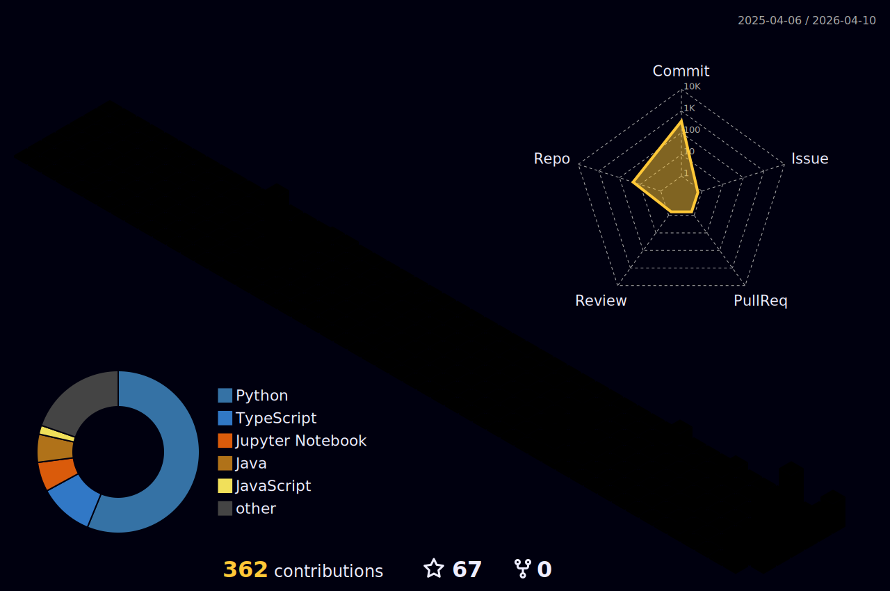

# Hi, I'm KUNAL ANAND! 

### 🎯 Data Science & Development Enthusiast

- 🎓 Currently pursuing **B.Tech CSE (Data Science)** at **LPU**
- 💻 Learning **DSA**, **MERN Stack**, and **Model Training**
- 🤝 Looking to collaborate on **Web + ML Projects**
- 🧠 Passionate about **AI**, **UI/UX**, and **Data Visualization**
- 📌 Goals: Contribute to **Open Source** & **Product Development**

---

### 🌐 Social Profiles

  
  
  
  
  
  
  

---

### 🧰 Tech Stack

  
  
  
  
  
  
  
  
  
  

---

### 📈 GitHub Analytics

  
  
  

---

### 🏆 GitHub Trophies

  

---

### 📊 Activity Graph

  

---

### 🐍 Snake Eating My Contribution Graph

  

---

### 3D Contribution Graph:📉

